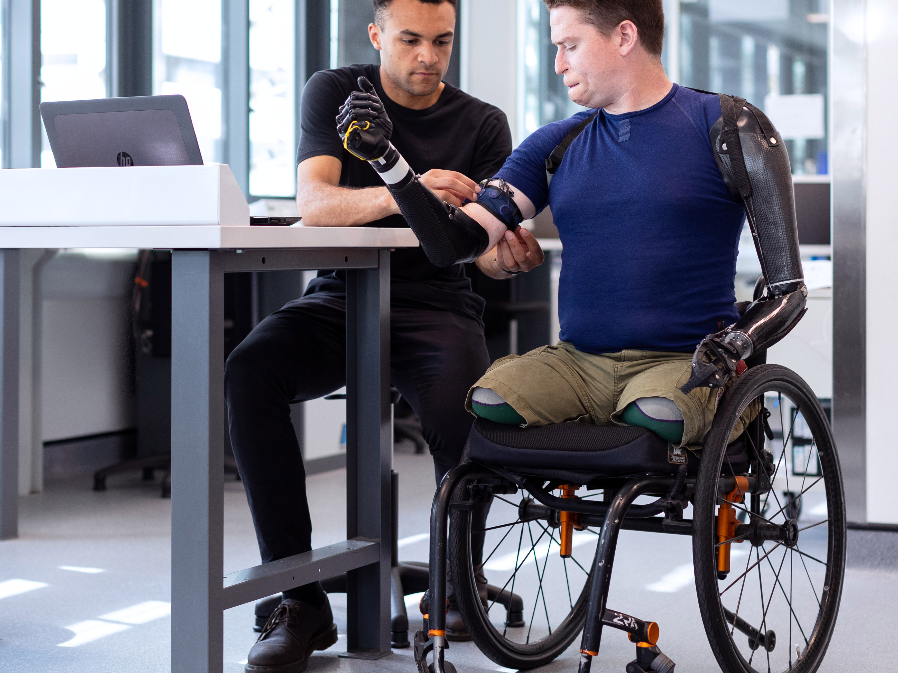
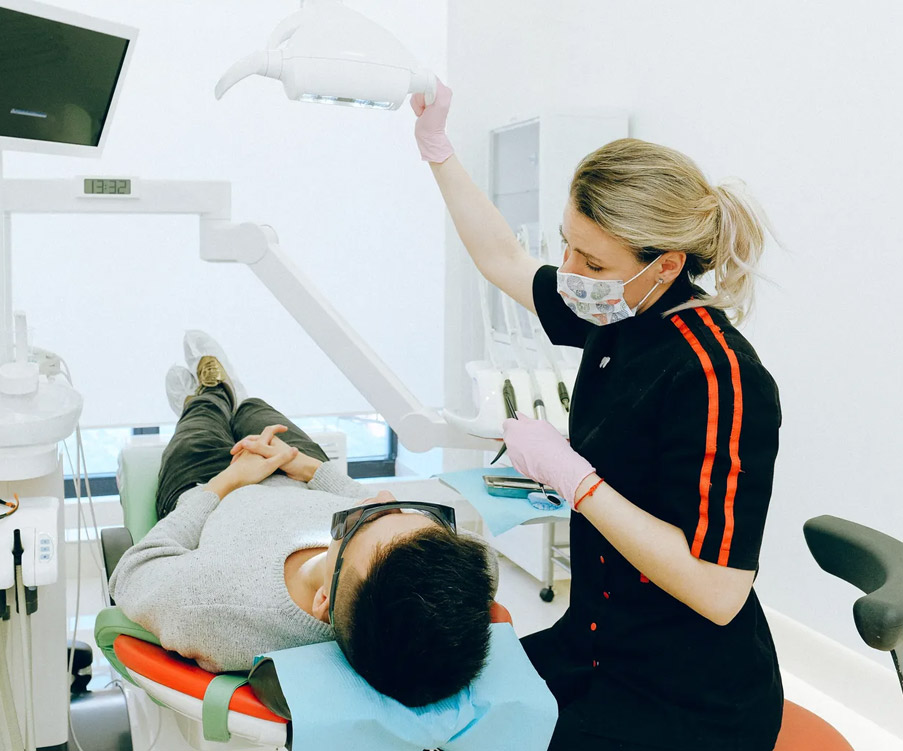

<!doctype html>
<html lang="zxx">

<head>
  <meta charset="utf-8">
  <meta name="viewport" content="width=device-width, initial-scale=1, shrink-to-fit=no">
  <link rel="stylesheet" href="assets/css/bootstrap.min.css">
  <link rel="stylesheet" href="assets/css/animate.min.css">
  <link rel="stylesheet" href="assets/css/fontawesome-all.min.css">
  <link rel="stylesheet" href="assets/css/owl.carousel.min.css">
  <link rel="stylesheet" href="assets/css/magnific-popup.min.css">
  <link rel="stylesheet" href="assets/css/odometer.min.css">
  <link rel="stylesheet" href="assets/css/meanmenu.css">
  <link rel="stylesheet" href="assets/css/style.css">

  <title>Sahha LLC</title>

  <link rel="icon" type="image/png" href="assets/img/favicon.png">
</head>

<body>

  <!-- Preloader -->
  

    

      

      

      

        <svg width="16px" height="12px">
          <polyline id="back" points="1 6 4 6 6 11 10 1 12 6 15 6"></polyline>
          <polyline id="front" points="1 6 4 6 6 11 10 1 12 6 15 6"></polyline>
        </svg>
      

    

  

  <!-- End Preloader -->

  <header class="header-area">
    

      

        

          

            

              
            

          

        

      

      

        

          

            <nav class="navbar navbar-expand-md navbar-light">
              

              

                <ul class="navbar-nav">
                  <li class="nav-item"><a href="#" class="nav-link active">Home</a></li>

                  <li class="nav-item"><a href="#" class="nav-link">About Us</a>

                  </li>

                  <li class="nav-item"><a href="#" class="nav-link">Services <i class="fal fa-angle-down"></i></a>
                    <ul class="dropdown-menu">
                      <li class="nav-item"><a href="#" class="nav-link">Wound Care</a></li>

                      <li class="nav-item"><a href="#" class="nav-link">Remote Monitoring</a></li>
                      <li class="nav-item"><a href="#" class="nav-link">Child Care</a></li>
                    </ul>
                  </li>

                  <li class="nav-item"><a href="#" class="nav-link">Gallery </a>

                  </li>
                  <li class="nav-item"><a href="#" class="nav-link">Team</a></li>
                  <li class="nav-item"><a href="#" class="nav-link">Contact</a></li>
                </ul>
                

                  <a href="#" class=""><i class="fal fa-phone-volume"></i> +91 8129409747
                    <!-- Call Us Today-->
                  </a>
                

              

            </nav>
          

        

      

    

  </header>

  

    

      

        

          

            

              

                

                  Sahha LLC
                  <h1>Experts Make A Difference</h1>
                  
Lorem ipsum dolor sit amet, consectetur adipiscing elit, sed do eiusmod tempor incididunt ut labore
                    et dolore magna Quis ipsumpsum dolor sit amet consectetur.

                  

                    <a href="https://www.youtube.com/watch?v=bk7McNUjWgw" class="btn btn-primary popup-youtube">Play Now
                      <i class="fas fa-play"></i></a>
                  

                

              

            

          

        

      

      

      

      

    

    

      

        

          

            

              

                

                  Sahha LLC
                  <h1>Experts Make A Difference</h1>
                  
Lorem ipsum dolor sit amet, consectetur adipiscing elit, sed do eiusmod tempor incididunt ut labore
                    et dolore magna Quis ipsumpsum dolor sit amet consectetur.

                  

                    <a href="#" class="btn btn-primary">About Us <i class="far fa-angle-right"></i></a>

                  

                

              

            

          

        

      

      

      

      

    

  

  

  <section class="choose-people bg-primary-half-lg z-index-n9">
    

      

        

          

            Why choose Us
            <h2 class="text-white mb-0">Our professional team is able to support you!</h2>
          

        

      

    

  </section>
  <section class="space-pb mt-n5 mt-lg-n7" style=" width: 100%; float: left;">
    

      

        

          

            

              
            

            <a href="#" class="sahha-service-box__name">Wound Care</a>
            

              <a href="#" class="more more--dark">View more</a>
              <a href="#" class="appointment" data-product-id="705"><i class="icon-marmite_symbol"></i>
                <b>Appointment</b>
              </a>
            

          

        

        

          

            

              
            

            <a href="#" class="sahha-service-box__name">Remote Monitoring</a>
            

              <a href="#" class="more more--dark">View more</a>
              <a href="#" class="appointment" data-product-id="705"><i class="icon-marmite_symbol"></i>
                <b>Appointment</b>
              </a>
            

          

        

        

          

            

              
            

            <a href="#" class="sahha-service-box__name">Child Care</a>
            

              <a href="#" class="more more--dark">View more</a>
              <a href="#" class="appointment" data-product-id="705"><i class="icon-marmite_symbol"></i>
                <b>Appointment</b>
              </a>
            

          

        

      

    

  </section>

  

  <section class="about-area">
    

      

        

          

            
          

        

        

          

            <h2>Your Trusted Partner in Healthcare</h2>
            
Lorem ipsum dolor sit amet, consectetur adipiscing elit, sed do eiusmod tempor incididunt ut labore et
              dolore magna aliqua. Quis ipsum suspendisse ultrices gravida. Risus commodo viverra maecenas accumsan
              lacus vel facilisis.

            <ul>
              <li><i class="fas fa-check"></i> Scientific Skills For getting a better result</li>
              <li><i class="fas fa-check"></i> Communication Skills to getting in touch</li>
              <li><i class="fas fa-check"></i> A Career Overview opportunity Available</li>
              <li><i class="fas fa-check"></i> A good Work Environment For work</li>
            </ul>

            <a href="#" class="btn btn-primary">Learn More <i class="far fa-angle-right"></i></a>
          

        

      

    

  </section>

  <section class="fun-facts-area ptb-100">
    

      

        

          

            

              <i class="flaticon-doctor-1"></i>
            

            <h3>
              
              +
            </h3>
            
Expert Doctors

          

        

        

          

            

              <i class="flaticon-light-bulb"></i>
            

            <h3>
              
              K
            </h3>
            
Problem Solve

          

        

        

          

            

              <i class="flaticon-science"></i>
            

            <h3>
              
              +
            </h3>
            
Award Winning

          

        

        

          

            

              <i class="flaticon-trophy"></i>
            

            <h3>
              
              +
            </h3>
            
Experiences

          

        

      

    

  </section>

  <section class="doctor-area ptb-100 bg-fefefe">
    

      

        Doctors
        <h2>Meet Our Medical Team</h2>

      

      

        

          

            

            <a href="#" class="details-btn"><i class="fas fa-plus"></i></a>
          

          

            <h3><a href="#">Dr. Aamer</a></h3>
            Designation

          

        

        

          

            

            <a href="#" class="details-btn"><i class="fas fa-plus"></i></a>
          

          

            <h3><a href="#">Dr. Faris</a></h3>
            Designation

          

        

        

          

            

            <a href="#" class="details-btn"><i class="fas fa-plus"></i></a>
          

          

            <h3><a href="#">Dr. Sarah Taylor</a></h3>
            Designation

          

        

        

          

            

            <a href="#" class="details-btn"><i class="fas fa-plus"></i></a>
          

          

            <h3><a href="#">Babatunde Jon</a></h3>
            Designation

          

        

      

    

  </section>

  <section class="appointment-area ptb-100 jarallax" data-jarallax='{"speed": 0.3}'>
    

    

  </section>

  <section class="footer-area">
    

      

        

          

            <ul class="departments-list">
              <li><a href="#">Wound Care</a></li>
              <li><a href="#">Remote Monitoring</a></li>
              <li><a href="#">Child Care</a></li>
              <li><a href="#">Our Doctors</a></li>
              <li><a href="#">Appointment</a></li>
              <li><a href="#">Contact Us</a></li>
            </ul>

          

        

        

          

            

              

                <h3>Improving Outcomes. Changing Lives</h3>
              

            

          

          

            

              

                <h5>Address</h5>
                
2665 South Bayshore Drive  Suite 220 
                  Coconut Grove  FL 33133

              

            

            

              

                <h5>Get In Touch</h5>
                <a href="#"><i class="fal fa-phone"></i> + 971 4 577 6673</a>
                <a href="#"><i class="fal fa-envelope"></i> info@yourdomain.com</a>
              

            

            

              

                <h5>Hours</h5>

                

                  Sat - Thu10 AM to 5:30 PM

                
FridayClosed

              

            

          

          

            

              

                
© 2020 Sahha LLC. All Rights Reserved.

              

            

          

        

      

    

  </section>

  
<i class="fas fa-chevron-up"></i>

  
  
  
  
  
  
  
  
  
  
  
</body>

</html>
